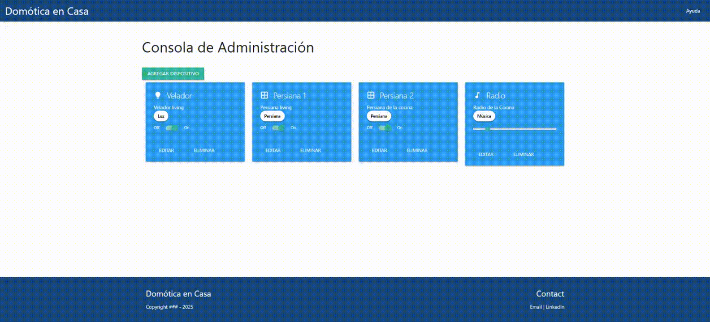

# 🏠 Domótica en Casa

SPA para controlar dispositivos del hogar como luces, persianas, aires y más.  
Desarrollado con HTML, TypeScript y Materialize CSS. Comunicación con backend mediante `XMLHttpRequest`.

---

## 🚀 Funcionalidades principales

- 📋 Visualización de dispositivos en tarjetas
- 🎚️ Control de estado con **switches** y **sliders**
- ✏️ Edición de nombre, descripción y tipo
- ➕ Agregado inline de nuevos dispositivos
- 🗑️ Eliminación con confirmación
- 🎨 Interfaz responsiva usando **Materialize CSS**
- 🔁 Comunicación con backend vía API RESTful

---

## 🧠 Tecnologías utilizadas

- **Frontend**: TypeScript + JavaScript Vanilla + Materialize CSS
- **Backend** (esperado): Node.js con Express
- **Comunicaciones**: `XMLHttpRequest` (`GET`, `POST`, `PUT`, `PATCH`)
- **Diseño**: Material Design con íconos para cada tipo de dispositivo

---

    → Listar dispositivos
    GET    /devices     

    → Crear dispositivo
    POST   /devices/:name/:desc/:state/:type 

    → Actualizar todos los campos
    PUT    /devices/:id/:name/:desc/:state/:type 

    → Actualizar un campo específico
    PATCH  /devices/:id/:attribute/:value           

    → Eliminar dispositivo
    DELETE /devices/:id                             

💡 Tipos de dispositivo (type)

| Código | Descripción | Ícono Materialize |
| ------ | ----------- | ----------------- |
| `0`    | Luz         | `lightbulb`       |
| `1`    | Persiana    | `window`          |
| `2`    | Aire        | `ac_unit`         |
| `3`    | Música      | `music_note`      |
| `4`    | Televisor   | `tv`              |
| `5`    | Ventilador  | `toys_fan`        |

📸 Captura

Muestra de funcionamiento de requerimientos de frontend:
    
- Registrar nuevos dispositivos.
- Eliminar dispositivo.
- Editar nombre, descripción y tipo de dispositivo.
- Consolidado de sliders y switch on-off. 

Muestra de funcionamiento de requerimientos de backend:
    
- Registrar nuevos dispositivos.
- Eliminar dispositivo.
- Editar nombre, descripción y tipo de dispositivo.

